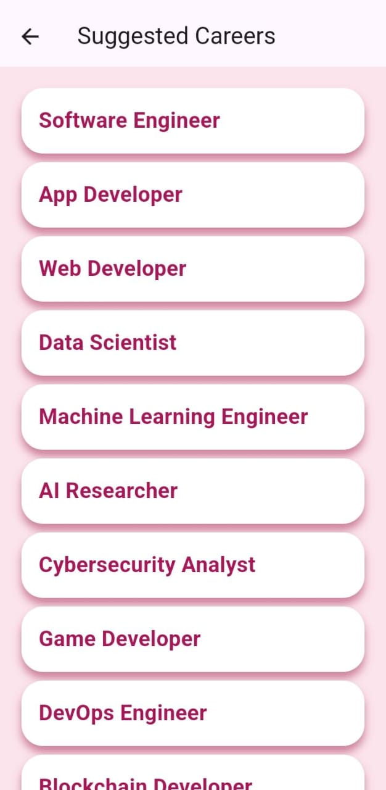
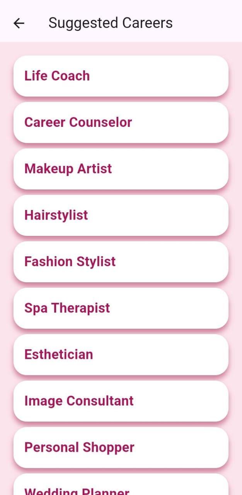

# 💖 Career Suggestion App

A dreamy career suggestion app that recommends jobs based on your interests and passions ✨  
Built with Flutter and powered by personality!

---

## 🌟 Features

- 🎯 Interest-based career recommendations
- 💅 Girly UI with vibrant tones (Fuchsia, Blue, Dreamy Vibes)
- 📱 Android-ready with downloadable APK
- 🌐 Responsive layout and smooth transitions

---

## 📲 Download the App

Click below to try it out on your Android device:

👉 **[Download APK](https://github.com/KamaliSri16/career_suggestion_app/raw/main/apk/app-release.apk)**

> 💡 Don't forget to enable **"Install from unknown sources"** in your Android settings!

---

## 🧠 How It Works

1. Enter your interest keywords (e.g., coding, fashion, animals, sports)
2. The app matches your interests to real-world careers using smart logic
3. Boom! Personalized career suggestions ✨

---

## 📸 Screenshots 

### 🏠 Home Screen

### ✨ Splash Screen

### 🎀 Input Page – Interests (Part 1)

### 💬 Input Page – More Interests (Part 2)

### 🎯 Suggested Careers – Results (Page 1)

### 🎯 Suggested Careers – More Results (Page 2)

